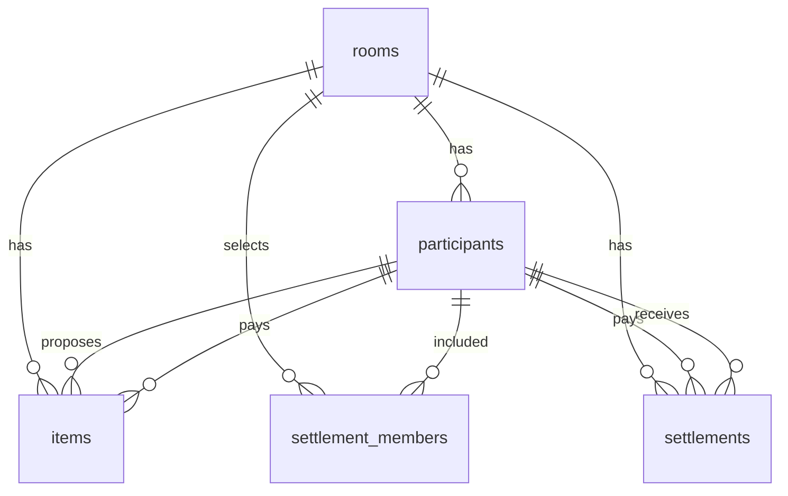
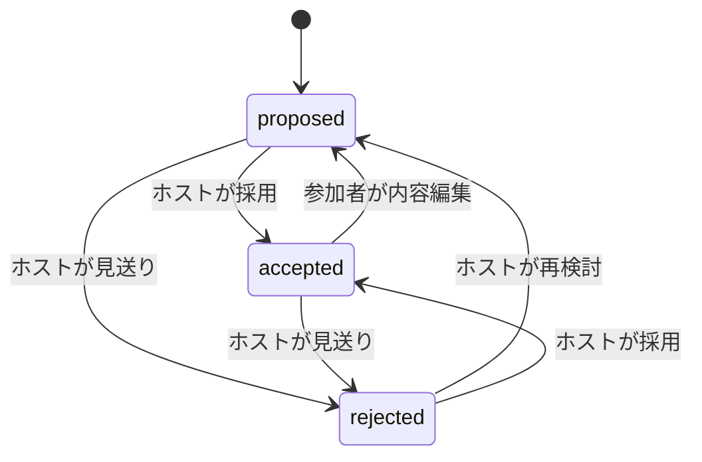

# OrderRoom DB・API設計書

更新日: 2026-07-18

対象: [MVP仕様](MVP.md)で定義したコア版と統合MVP  
構成: React + TypeScript / Spring Boot / PostgreSQL / REST JSON

この資料はテーブル、API、認証、集計、精算計算、デプロイ技術仕様を管理する。MVP範囲、期限、実装順は[ロードマップ](%E3%83%AD%E3%83%BC%E3%83%89%E3%83%9E%E3%83%83%E3%83%97.md)を優先する。

## 1. 設計原則

| 項目 | 決定 |
| --- | --- |
| ID | UUID。参加URLから連番を推測させない |
| API形式 | `/api`配下のREST JSON |
| 参加者本人確認 | 参加時にtokenを発行し、`X-Participant-Token`で送る |
| ホスト確認 | ルーム作成時にhostKeyを発行し、`X-Host-Key`で送る |
| 金額 | 日本円の整数。負値を許可しない |
| 商品状態 | `proposed / accepted / rejected` |
| 集計 | 見積と精算結果は計算し、重複保存しない |
| 見送り | 削除せず保持し、通常一覧と集計から除外する |
| 同期 | 手動更新で再取得する |
| DB | Neon PostgreSQL |

### 名前の固定

- 日付はAPIで `eventDate`、DBで `event_date`
- ホスト秘密値はAPIで `hostKey`、DBで `host_key`
- 参加者秘密値は `token`
- 提案中は `proposed`。`pending`は使用しない
- UIの「見送り」に対応するAPI値は `rejected`
- `price`は見積単価、`actualPrice`は商品行全体の実購入額

## 2. データモデル



### 2.1 rooms

| カラム | 型 | 制約 | 説明 |
| --- | --- | --- | --- |
| `id` | UUID | PK | ルームID |
| `title` | VARCHAR(100) | NOT NULL | イベント名 |
| `event_date` | DATE | NULL可 | 開催日 |
| `memo` | TEXT | NULL可 | メモ |
| `budget_amount` | INTEGER | NULL可、0以上 | 予算上限。NULLなら予算表示なし |
| `host_key` | UUID | NOT NULL、UNIQUE | ホスト秘密値 |
| `created_at` | TIMESTAMPTZ | NOT NULL | 作成日時 |

### 2.2 participants

| カラム | 型 | 制約 | 説明 |
| --- | --- | --- | --- |
| `id` | UUID | PK | 公開可能な参加者ID |
| `room_id` | UUID | FK、NOT NULL | 所属ルーム |
| `name` | VARCHAR(50) | NOT NULL | 表示名 |
| `token` | UUID | NOT NULL、UNIQUE | 本人確認用。参加時以外は返さない |
| `created_at` | TIMESTAMPTZ | NOT NULL | 参加順の判定にも使う |

### 2.3 items

| カラム | 型 | 制約 | 説明 |
| --- | --- | --- | --- |
| `id` | UUID | PK | 商品ID |
| `room_id` | UUID | FK、NOT NULL | 所属ルーム |
| `participant_id` | UUID | FK、NOT NULL | 提案者 |
| `name` | VARCHAR(100) | NOT NULL | 商品名 |
| `price` | INTEGER | NOT NULL、0以上、default 0 | 見積単価 |
| `quantity` | INTEGER | NOT NULL、1以上、default 1 | 数量 |
| `memo` | TEXT | NULL可 | メモ |
| `status` | VARCHAR(20) | NOT NULL、default proposed | proposed / accepted / rejected |
| `purchased` | BOOLEAN | NOT NULL、default false | 購入済み |
| `actual_price` | INTEGER | NULL可、0以上 | 商品行全体の実購入額 |
| `paid_by_participant_id` | UUID | FK、NULL可 | 購入者 |
| `created_at` | TIMESTAMPTZ | NOT NULL | 作成日時 |
| `updated_at` | TIMESTAMPTZ | NOT NULL | 更新日時 |

制約:

- purchasedはacceptedだけtrueにできる
- actual_priceとpaid_by_participant_idは、acceptedかつpurchasedの商品だけに設定できる
- paid_by_participant_idは同じroomの参加者でなければならない
- actual_priceとpaid_by_participant_idは両方入力または両方NULLにする

### 2.4 settlement_members

精算対象に含める参加者だけを保存する。

| カラム | 型 | 制約 | 説明 |
| --- | --- | --- | --- |
| `room_id` | UUID | FK、複合PK | ルーム |
| `participant_id` | UUID | FK、複合PK | 精算対象者 |
| `created_at` | TIMESTAMPTZ | NOT NULL | 登録日時 |

初回計算時に未設定なら全参加者を対象とする。対象者0人は許可しない。

### 2.5 settlements

送金案を精算状態付きで保持する。負担額や立替額そのものは保存せず、計算時に返す。

| カラム | 型 | 制約 | 説明 |
| --- | --- | --- | --- |
| `id` | UUID | PK | 精算ID |
| `room_id` | UUID | FK、NOT NULL | ルーム |
| `from_participant_id` | UUID | FK、NOT NULL | 支払側 |
| `to_participant_id` | UUID | FK、NOT NULL | 受取側 |
| `amount` | INTEGER | NOT NULL、1以上 | 送金額 |
| `settled_at` | TIMESTAMPTZ | NULL可 | 精算済み日時 |
| `created_at` | TIMESTAMPTZ | NOT NULL | 計算結果作成日時 |

同じ参加者をfromとtoへ設定しない。精算再計算時は未精算の送金案を置き換える。

## 3. 状態遷移



- status変更はホストだけが行う
- 参加者によるaccepted商品の編集は自動でproposedへ戻し、purchasedをfalseにする
- ホスト編集はacceptedを維持できる
- rejectedは物理削除しない
- purchasedをfalseへ戻す場合はactualPriceと購入者もクリアする
- actualPriceが精算計算へ使用された後でも、精算済みが0件なら変更して再計算できる
- 精算済みが1件以上ある場合、商品編集、削除、status変更、purchased変更、購入詳細変更を409で拒否する

## 4. 認証と秘密値

### 4.1 参加者token

- 参加APIの成功時に一度だけ返す
- FEは `orderroom.participantToken.{roomId}` のようにroom単位でlocalStorageへ保存する
- 商品作成、編集、削除、参加者本人の精算済み操作で送る
- 一覧APIやエラーログへ出さない
- リクエスト本文のparticipantIdを本人確認に使わない

### 4.2 hostKey

- ルーム作成APIの成功時に一度だけ返す
- FEはホストURLのkeyをsessionStorageへ移し、可能ならURLから除去する
- ホスト操作では `X-Host-Key` を送る
- 通常のルーム取得、参加、一覧レスポンスへ含めない

### 4.3 エラー

- tokenまたはhostKeyの欠如・不一致: 403
- ルーム、参加者、商品、精算の不存在: 404
- 他ルームのIDを組み合わせた操作: 404または403で統一し、存在確認へ利用できないようにする

## 5. API共通仕様

| 項目 | 内容 |
| --- | --- |
| Base path | `/api` |
| Content-Type | `application/json; charset=UTF-8` |
| 日付 | `YYYY-MM-DD` |
| 日時 | ISO 8601 UTC |
| 成功 | 200、201、204 |
| 入力不正 | 400 |
| 権限不足 | 403 |
| 不存在 | 404 |
| 状態競合 | 409 |

エラーレスポンス:

```json
{
  "code": "VALIDATION_ERROR",
  "message": "入力内容を確認してください",
  "fields": {
    "budgetAmount": "0以上で入力してください"
  },
  "timestamp": "2026-07-18T12:00:00Z"
}
```

秘密値、SQL、スタックトレースをレスポンスへ含めない。

## 6. エンドポイント一覧

### 6.1 ルーム・参加者

| Method | Path | 権限 | 概要 |
| --- | --- | --- | --- |
| GET | `/api/health` | 公開 | 死活監視 |
| POST | `/api/rooms` | 公開 | ルーム作成 |
| GET | `/api/rooms/{roomId}` | 公開 | 参加前に必要なルーム情報取得 |
| POST | `/api/rooms/{roomId}/participants` | 公開 | 表示名で参加しtoken発行 |
| GET | `/api/rooms/{roomId}/participants` | 参加者またはホスト | 参加者一覧 |

### 6.2 商品・集計

| Method | Path | 権限 | 概要 |
| --- | --- | --- | --- |
| POST | `/api/rooms/{roomId}/items` | 参加者 | 商品提案 |
| GET | `/api/rooms/{roomId}/items` | 参加者またはホスト | 商品一覧 |
| PATCH | `/api/rooms/{roomId}/items/{itemId}` | 提案者またはホスト | 商品内容編集 |
| DELETE | `/api/rooms/{roomId}/items/{itemId}` | 提案者またはホスト | 商品削除 |
| PATCH | `/api/rooms/{roomId}/items/{itemId}/status` | ホスト | 採用・見送り |
| PATCH | `/api/rooms/{roomId}/items/{itemId}/purchased` | ホスト | 購入済み変更 |
| PATCH | `/api/rooms/{roomId}/items/{itemId}/purchase-detail` | ホスト | 実購入額・購入者 |
| GET | `/api/rooms/{roomId}/summary` | 参加者またはホスト | 見積・予算集計 |

### 6.3 精算

| Method | Path | 権限 | 概要 |
| --- | --- | --- | --- |
| PUT | `/api/rooms/{roomId}/settlement-members` | ホスト | 精算対象者を置換 |
| POST | `/api/rooms/{roomId}/settlement/recalculate` | ホスト | 負担額と送金案を再計算 |
| GET | `/api/rooms/{roomId}/settlement` | 参加者またはホスト | 現在の精算結果取得 |
| PATCH | `/api/rooms/{roomId}/settlements/{settlementId}/settled` | 支払側本人またはホスト | 精算済み変更 |
| POST | `/api/rooms/{roomId}/settlement/reset` | ホスト | 全精算を未精算へ戻す |

## 7. 主要リクエストとレスポンス

### 7.1 POST `/api/rooms`

Request:

```json
{
  "title": "キャンプ",
  "eventDate": "2026-08-01",
  "memo": "駅前で買い出し",
  "budgetAmount": 12000
}
```

Response 201。hostKeyはこの応答だけで返す。

```json
{
  "id": "b7e2...",
  "title": "キャンプ",
  "eventDate": "2026-08-01",
  "memo": "駅前で買い出し",
  "budgetAmount": 12000,
  "hostKey": "9f13...",
  "participantUrl": "https://app.example.com/rooms/b7e2...",
  "hostUrl": "https://app.example.com/rooms/b7e2.../host?key=9f13...",
  "createdAt": "2026-07-18T12:00:00Z"
}
```

### 7.2 GET `/api/rooms/{roomId}`

Response 200。hostKeyは含めない。

```json
{
  "id": "b7e2...",
  "title": "キャンプ",
  "eventDate": "2026-08-01",
  "memo": "駅前で買い出し",
  "budgetAmount": 12000,
  "createdAt": "2026-07-18T12:00:00Z"
}
```

### 7.3 POST `/api/rooms/{roomId}/participants`

Request:

```json
{ "name": "太郎" }
```

Response 201。tokenはこの応答だけで返す。

```json
{
  "id": "1a2b...",
  "roomId": "b7e2...",
  "name": "太郎",
  "token": "77aa...",
  "createdAt": "2026-07-18T12:10:00Z"
}
```

### 7.4 POST `/api/rooms/{roomId}/items`

Header: `X-Participant-Token`

```json
{
  "name": "コーラ",
  "price": 200,
  "quantity": 4,
  "memo": "1.5L"
}
```

提案者はtokenから決定する。本文へparticipantIdを送らない。初期値はstatus=proposed、purchased=false。

### 7.5 GET `/api/rooms/{roomId}/items`

Query:

- `status=proposed|accepted|rejected`
- `participantId={uuid}`

省略時は権限に応じた全件を返す。通常参加者画面ではrejectedを要求しない。レスポンスへparticipantNameを含め、tokenを含めない。

### 7.6 PATCH 商品内容

参加者は `X-Participant-Token`、ホストは `X-Host-Key` を送る。

```json
{
  "name": "コーラ",
  "price": 180,
  "quantity": 6,
  "memo": "ゼロも可"
}
```

- 参加者は自分の提案だけ操作できる
- 参加者がacceptedを編集するとproposedへ戻す
- proposedへ戻すときはpurchased=falseとし、actualPriceと購入者をクリアする
- status、purchased、actualPrice、paidByParticipantIdはこのAPIで変更しない

### 7.7 PATCH status・purchased

Header: `X-Host-Key`

```json
{ "status": "accepted" }
```

```json
{ "purchased": true }
```

accepted以外をpurchased=trueにする要求は400とする。

purchasedをfalseへ戻した場合はactualPriceとpaidByParticipantIdをNULLへ戻す。精算済みがある場合は変更を409で拒否する。

### 7.8 PATCH purchase-detail

Header: `X-Host-Key`

```json
{
  "actualPrice": 720,
  "paidByParticipantId": "1a2b..."
}
```

actualPriceは単価ではなく、この商品行全体の実支払額である。

### 7.9 GET `/api/rooms/{roomId}/summary`

```json
{
  "roomId": "b7e2...",
  "acceptedTotalPrice": 3200,
  "proposedTotalPrice": 1500,
  "budgetAmount": 12000,
  "remainingBudget": 8800,
  "overBudgetAmount": 0,
  "acceptedItemCount": 5,
  "byStatus": {
    "proposed": 4,
    "accepted": 5,
    "rejected": 1
  },
  "perParticipant": [
    {
      "participantId": "1a2b...",
      "name": "太郎",
      "proposalCount": 3,
      "acceptedTotalPrice": 1200
    }
  ],
  "itemQuantities": [
    { "name": "コーラ", "totalQuantity": 4, "estimatedTotalPrice": 800 }
  ]
}
```

- acceptedTotalPriceはacceptedの見積だけ
- proposedTotalPriceはproposedの見積だけ
- rejectedは件数以外の集計へ含めない
- 予算未設定時、budgetAmount、remainingBudget、overBudgetAmountはnull
- 超過時はremainingBudget=0、overBudgetAmountを正の値で返す

## 8. 精算計算

### 8.1 計算対象

acceptedかつpurchasedで、actualPriceと購入者が入力済みの商品だけを使う。未入力商品は `incompletePurchaseItems` として警告へ返す。

### 8.2 均等負担

1. 実購入額合計を対象人数で整数除算する
2. 商を全員の基本負担額とする
3. 余りを参加登録順の早い人から1円ずつ加える
4. createdAtが同じ場合はparticipantIdで順序を固定する

### 8.3 立替差額と送金案

- 立替額 = その参加者が購入者になっているactualPriceの合計
- 差額 = 立替額 - 負担額
- 差額が負の人を支払側、正の人を受取側とする
- 参加登録順で並べ、支払側と受取側を順に相殺する
- 0円の送金案は作らない

必須の整合条件:

- 負担額合計 = 実購入額合計
- 立替額合計 = 実購入額合計
- 全参加者の差額合計 = 0
- 送金案合計 = 支払不足合計 = 受取超過合計
- 同じ入力では同じ送金案になる

### 8.4 再計算とロック

- 精算済みが0件なら、ホストは対象者や購入情報を変更して再計算できる
- 精算済みが1件以上なら、実購入額、購入者、対象者、再計算を409で拒否する
- resetは全件のsettledAtをNULLにする
- reset後に購入情報を変え、recalculateで送金案を置き換えられる

### 8.5 精算レスポンス例

```json
{
  "actualTotalPrice": 10001,
  "incompletePurchaseItems": [],
  "members": [
    {
      "participantId": "1a2b...",
      "name": "太郎",
      "burdenAmount": 3334,
      "paidAmount": 10001,
      "balanceAmount": 6667
    }
  ],
  "transfers": [
    {
      "id": "9c8d...",
      "fromParticipantId": "2b3c...",
      "toParticipantId": "1a2b...",
      "amount": 3334,
      "settledAt": null
    }
  ],
  "locked": false
}
```

## 9. バリデーション

| 対象 | ルール |
| --- | --- |
| title | 必須、空白だけ不可、100文字以内 |
| eventDate | ISO日付 |
| budgetAmount | NULLまたは0以上の整数 |
| name | 必須、空白だけ不可、50文字以内 |
| item name | 必須、空白だけ不可、100文字以内 |
| price | 0以上の整数 |
| quantity | 1以上の整数 |
| actualPrice | NULLまたは0以上の整数 |
| status | proposed / accepted / rejected |
| settlement members | 1人以上、同一roomの参加者だけ |

## 10. デプロイ仕様

### 10.1 構成

| 領域 | 採用先 | 設定 |
| --- | --- | --- |
| FE | Cloudflare Pages | Root `frontend`、build `npm run build`、output `dist` |
| API | Render Web Service | DockerfileからJava 21アプリを実行 |
| DB | Neon PostgreSQL | pooled接続、SSL必須 |

Cloudflare Pagesではtop-level `404.html`を置かず、SPA fallbackで `/rooms/{uuid}` をルートへ渡す。実際の直接アクセスは本番受け入れ試験で確認する。

Renderでは `backend/orderroom-backend/Dockerfile` を指定し、`/api/health` をHealth Check Pathにする。

### 10.2 環境変数

| 配置先 | 変数 | 内容 |
| --- | --- | --- |
| Cloudflare Pages | `VITE_API_BASE_URL` | Render APIのHTTPS URL |
| Render | `DB_URL` | NeonのJDBC接続URL |
| Render | `DB_USER` | DBユーザー |
| Render | `DB_PASSWORD` | DBパスワード |
| Render | `FRONTEND_BASE_URL` | Cloudflare Pages本番URL |
| Render | `SPRING_PROFILES_ACTIVE` | `prod` |

JDBC URLはNeon ConsoleのJava用接続情報を基準にし、SSLとchannel bindingを有効にする。Webアプリ接続はpooled hostnameを使い、マイグレーションや管理作業は必要に応じてdirect接続を使う。

### 10.3 Spring Boot本番設定

```properties
server.port=${PORT:8080}
spring.datasource.url=${DB_URL}
spring.datasource.username=${DB_USER}
spring.datasource.password=${DB_PASSWORD}
app.frontend-base-url=${FRONTEND_BASE_URL}
spring.jpa.show-sql=false
```

MVP期間は `ddl-auto=update` を暫定利用する。v1.0後にFlywayを導入し、本番を `ddl-auto=validate` へ変更する。

### 10.4 CORS

- 本番はFRONTEND_BASE_URLと一致するOriginだけ許可する
- 開発環境はVite proxyを優先する
- `Content-Type`、`X-Participant-Token`、`X-Host-Key` を許可する
- PR Previewから本番APIを呼ばせない
- `*` とcredentialsを併用しない

## 11. テスト受け入れ条件

- 外部のNeon認証情報なしで自動テストを実行できる
- ルーム作成、参加、商品権限、状態遷移、集計、精算をテストする
- 他ルームのtoken、hostKey、participantIdを拒否する
- participant tokenとhostKeyがレスポンスやログへ漏れない
- 予算未設定、0円、超過を確認する
- 1円、割り切れない合計、複数購入者、対象者1人を確認する
- 精算済み後の変更ロックとresetを確認する
- 本番でHealth API、DB接続、CORS、SPA直接アクセスを確認する

テストDBはTestcontainersのPostgreSQL、またはRepositoryを分離したモックを使用する。通常のテスト実行を本番DBへ接続しない。

## 12. MVP後の技術負債

- Flyway導入と `ddl-auto=validate` への移行
- tokenとhostKeyのローテーション、失効
- 楽観ロックによる同時編集対策
- 商品と精算の監査履歴
- レート制限
- 厳密なアカウント認証
