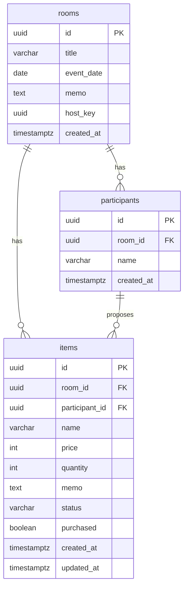

# オーダールーム 設計書（テーブル設計 → API設計）

対象: MVP（提案 → 採用 → 買い物リスト → 合計金額表示）
スタック: React + TypeScript / Spring Boot / PostgreSQL / REST(JSON)
準拠: BE ラベル issue #4〜#17（本設計書は各issueに対応づけて記載）

---

## 0. 設計方針・前提

| 項目 | 決定 | 理由 |
| --- | --- | --- |
| 主キー | UUID | 参加URL・ホスト管理URLにIDを載せるため、連番だと他ルームを推測できてしまう |
| ホスト権限 | `host_key`（UUID）を別発行し `X-Host-Key` ヘッダで送る | ログインを作らずに採用/却下/購入チェックを制御する（issue #13） |
| 参加者の本人性 | 参加時に発行する `participantId` を `X-Participant-Id` ヘッダで送る | MVPは「厳密な認証より導線優先」。自分の提案だけ編集/削除する簡易判定 |
| 金額 | 円想定で `INTEGER` | 日本円は小数なし。小数対応が必要になれば `NUMERIC` に変更 |
| 集計 | 保存しない（SQLで都度計算） | issue #16。提案データが唯一の正 |
| 集計対象 | 合計金額・個人別合計は **採用（accepted）** のアイテムで計算 | 「採用されたものが買い物リストになり合計する」流れに合わせる（要確認事項として §9 に明記） |
| リアルタイム | なし（画面表示時／更新時に再取得） | MVP非スコープ |

> セキュリティ強度は「イベント中に使いやすい」ことを優先した割り切り。強化案は §10 に記載。

---

## 1. ER図



---

## 2. テーブル設計

### 2.1 rooms（ルーム）— issue #6

| カラム | 型 | 制約 | 説明 |
| --- | --- | --- | --- |
| id | UUID | PK, default gen_random_uuid() | ルームID。参加URLに含める |
| title | VARCHAR(100) | NOT NULL | イベント名 |
| event_date | DATE | NULL可 | 開催日 |
| memo | TEXT | NULL可 | メモ |
| host_key | UUID | NOT NULL, UNIQUE, default gen_random_uuid() | ホスト管理URL用の秘密キー |
| created_at | TIMESTAMPTZ | NOT NULL, default now() | 作成日時 |

> **カラム名の補足**: issue #6 のカラム案は `date` ですが、`date` はSQLで予約語的で扱いづらいため、実装では `event_date`（Entityフィールドは `eventDate`）とします。意味は同じです。

### 2.2 participants（参加者）— issue #7

| カラム | 型 | 制約 | 説明 |
| --- | --- | --- | --- |
| id | UUID | PK | 参加者ID。クライアントが保持し、自分の提案編集に使う |
| room_id | UUID | NOT NULL, FK→rooms(id) ON DELETE CASCADE | 所属ルーム |
| name | VARCHAR(50) | NOT NULL | 表示名（空文字不可・§4のバリデーション参照） |
| created_at | TIMESTAMPTZ | NOT NULL, default now() | 参加日時 |

### 2.3 items（提案アイテム）— issue #8

| カラム | 型 | 制約 | 説明 |
| --- | --- | --- | --- |
| id | UUID | PK | アイテムID |
| room_id | UUID | NOT NULL, FK→rooms(id) ON DELETE CASCADE | 所属ルーム |
| participant_id | UUID | NOT NULL, FK→participants(id) ON DELETE CASCADE | 提案者 |
| name | VARCHAR(100) | NOT NULL | 商品名 |
| price | INTEGER | NOT NULL default 0, CHECK(price>=0) | 単価（円） |
| quantity | INTEGER | NOT NULL default 1, CHECK(quantity>=1) | 数量 |
| memo | TEXT | NULL可 | メモ |
| status | VARCHAR(20) | NOT NULL default 'proposed', CHECK(IN) | proposed / accepted / rejected |
| purchased | BOOLEAN | NOT NULL default false | 購入済みチェック |
| created_at | TIMESTAMPTZ | NOT NULL, default now() | 作成日時 |
| updated_at | TIMESTAMPTZ | NOT NULL, default now() | 更新日時（issue案には無いが更新管理用に追加） |

#### status の値

| 値 | 意味 |
| --- | --- |
| proposed | 提案中（初期値） |
| accepted | 採用（買い物リストに載る） |
| rejected | 却下 |

> `purchased` は `status = 'accepted'` のときだけ意味を持つ（採用されたものを買ったかどうか）。

### 2.4 DDL（PostgreSQL）

```sql
-- gen_random_uuid() は PostgreSQL 13+ なら標準。古い場合は pgcrypto を有効化
-- CREATE EXTENSION IF NOT EXISTS pgcrypto;

CREATE TABLE rooms (
    id          UUID PRIMARY KEY DEFAULT gen_random_uuid(),
    title       VARCHAR(100) NOT NULL,
    event_date  DATE,
    memo        TEXT,
    host_key    UUID NOT NULL DEFAULT gen_random_uuid(),
    created_at  TIMESTAMPTZ NOT NULL DEFAULT now()
);
CREATE UNIQUE INDEX idx_rooms_host_key ON rooms (host_key);

CREATE TABLE participants (
    id          UUID PRIMARY KEY DEFAULT gen_random_uuid(),
    room_id     UUID NOT NULL REFERENCES rooms (id) ON DELETE CASCADE,
    name        VARCHAR(50) NOT NULL,
    created_at  TIMESTAMPTZ NOT NULL DEFAULT now()
);
CREATE INDEX idx_participants_room_id ON participants (room_id);

CREATE TABLE items (
    id             UUID PRIMARY KEY DEFAULT gen_random_uuid(),
    room_id        UUID NOT NULL REFERENCES rooms (id) ON DELETE CASCADE,
    participant_id UUID NOT NULL REFERENCES participants (id) ON DELETE CASCADE,
    name           VARCHAR(100) NOT NULL,
    price          INTEGER NOT NULL DEFAULT 0 CHECK (price >= 0),
    quantity       INTEGER NOT NULL DEFAULT 1 CHECK (quantity >= 1),
    memo           TEXT,
    status         VARCHAR(20) NOT NULL DEFAULT 'proposed'
                     CHECK (status IN ('proposed', 'accepted', 'rejected')),
    purchased      BOOLEAN NOT NULL DEFAULT FALSE,
    created_at     TIMESTAMPTZ NOT NULL DEFAULT now(),
    updated_at     TIMESTAMPTZ NOT NULL DEFAULT now()
);
CREATE INDEX idx_items_room_id        ON items (room_id);
CREATE INDEX idx_items_room_status    ON items (room_id, status);
CREATE INDEX idx_items_participant_id ON items (participant_id);

-- updated_at 自動更新（アプリ側 @PreUpdate で行うなら不要）
CREATE OR REPLACE FUNCTION set_updated_at() RETURNS trigger AS $$
BEGIN
    NEW.updated_at = now();
    RETURN NEW;
END;
$$ LANGUAGE plpgsql;

CREATE TRIGGER trg_items_updated_at
    BEFORE UPDATE ON items
    FOR EACH ROW EXECUTE FUNCTION set_updated_at();
```

---

## 3. 集計（保存せずSQLで計算）— issue #16

すべて `items` から算出する。以下は参照用の生SQL（Spring では JPQL / native query どちらでも可）。

```sql
-- 全体の合計金額（採用のみ）
SELECT COALESCE(SUM(price * quantity), 0) AS accepted_total_price
FROM items WHERE room_id = :roomId AND status = 'accepted';

-- ステータス別の件数
SELECT status, COUNT(*) FROM items
WHERE room_id = :roomId GROUP BY status;

-- 個人別（提案数 / 採用合計金額）
SELECT p.id, p.name,
       COUNT(i.id)                                          AS proposal_count,
       COALESCE(SUM(CASE WHEN i.status = 'accepted'
                         THEN i.price * i.quantity END), 0) AS accepted_total_price
FROM participants p
LEFT JOIN items i ON i.participant_id = p.id
WHERE p.room_id = :roomId
GROUP BY p.id, p.name
ORDER BY p.created_at;

-- 商品名ごとの合計数量・金額（採用のみ）
SELECT name,
       SUM(quantity)          AS total_quantity,
       SUM(price * quantity)  AS total_price
FROM items
WHERE room_id = :roomId AND status = 'accepted'
GROUP BY name
ORDER BY total_quantity DESC;
```

---

## 4. API共通仕様

| 項目 | 内容 |
| --- | --- |
| ベースパス | `/api` |
| 形式 | JSON（UTF-8） |
| ホスト認証（issue #13） | ヘッダ `X-Host-Key: <host_key>`。不一致/欠如は 403 |
| 参加者識別 | ヘッダ `X-Participant-Id: <participantId>`（自分の提案の編集/削除時） |
| 日時 | ISO 8601（例 `2026-07-08T12:00:00Z`） |

### ステータスコード

| コード | 用途 |
| --- | --- |
| 200 OK | 取得・更新成功 |
| 201 Created | 作成成功 |
| 204 No Content | 削除成功 |
| 400 Bad Request | バリデーションエラー |
| 403 Forbidden | ホストキー不正 / 他人の提案を操作 |
| 404 Not Found | ルーム・アイテム不存在（存在しないroomId 等） |

### バリデーション（issue #17）

| 対象 | ルール |
| --- | --- |
| 参加者名（name） | 必須・空文字不可・最大50文字 |
| 商品名（name） | 必須・空文字不可・最大100文字 |
| 価格（price） | 0以上の整数 |
| 数量（quantity） | 1以上の整数 |
| roomId | 存在しなければ 404 |
| host_key | 不一致は 403 |

### エラーレスポンス形式

```json
{
  "error": "FORBIDDEN",
  "message": "ホストキーが不正です",
  "fields": { "price": "0以上で入力してください" }
}
```

---

## 5. エンドポイント一覧（issue対応）

### コアAPI（BE issueに対応）

| # | Method | パス | 権限 | 対応Issue | 概要 |
| --- | --- | --- | --- | --- | --- |
| H | GET | `/api/health` | 誰でも | #4 | 死活監視（サーバー生存確認） |
| 1 | POST | `/api/rooms` | 誰でも | #9 | ルーム作成（host_key を発行して返す） |
| 2 | POST | `/api/rooms/{roomId}/participants` | 参加者 | #10 | 名前を入力して参加 |
| 3 | POST | `/api/rooms/{roomId}/items` | 参加者 | #11 | 欲しいものを提案 |
| 4 | GET | `/api/rooms/{roomId}/items` | 参加者 | #12 | 提案一覧（`?status=` で絞込可） |
| 5 | PATCH | `/api/rooms/{roomId}/items/{itemId}/status` | ホスト | #14 | 採用 / 却下 |
| 6 | PATCH | `/api/rooms/{roomId}/items/{itemId}/purchased` | ホスト | #15 | 購入済みチェック切替 |
| 7 | GET | `/api/rooms/{roomId}/summary` | 参加者 | #16 | 集計（合計金額・個人別・商品別） |

> **買い物リスト（F6）** は独立エンドポイントを作らず、#4 の `GET /api/rooms/{roomId}/items?status=accepted` で表現する（issue #12 の範囲）。

### 補助API（画面実装に必要だが対応issueが未登録）

| # | Method | パス | 権限 | 概要 | 対応 |
| --- | --- | --- | --- | --- | --- |
| A1 | GET | `/api/rooms/{roomId}` | 参加者 | ルーム情報取得（title/date/memo） | 参加画面のイベント名表示に必要。**issue化を推奨** |
| A2 | GET | `/api/rooms/{roomId}/participants` | 参加者 | 参加者一覧 | 任意。F9は #12(items) で代替可 |

### 今回のBEスコープ外（別途issue化が必要）

| Method | パス | 概要 | 備考 |
| --- | --- | --- | --- |
| PATCH | `/api/rooms/{roomId}/items/{itemId}` | 自分の提案を編集 | コンセプト「自分の注文を編集」。対応issue無し。実装するなら要起票＋`participant_token`検討（§10） |
| DELETE | `/api/rooms/{roomId}/items/{itemId}` | 自分の提案を削除 | 同上 |

---

## 6. エンドポイント詳細

### H. GET `/api/health` — 死活監視（issue #4）

Request: なし（認証不要）
Response `200`
```json
{ "status": "ok" }
```
> DB接続まで含めない liveness 想定。必要になれば `SELECT 1` を足した readiness 版に拡張。Render等のヘルスチェック宛先にも使う。

### 1. POST `/api/rooms` — ルーム作成（issue #9）

Request
```json
{ "title": "花子の誕生日会", "eventDate": "2026-07-20", "memo": "会費3000円まで" }
```
Response `201`（**host_key を返すのはここだけ**）
```json
{
  "id": "b7e2...",
  "title": "花子の誕生日会",
  "eventDate": "2026-07-20",
  "memo": "会費3000円まで",
  "hostKey": "9f13...",
  "participantUrl": "https://app.example.com/rooms/b7e2...",
  "hostUrl": "https://app.example.com/rooms/b7e2.../host?key=9f13...",
  "createdAt": "2026-07-08T12:00:00Z"
}
```

### 2. POST `/api/rooms/{roomId}/participants` — 参加（issue #10）

Request
```json
{ "name": "太郎" }
```
バリデーション: `name` 必須・空文字不可（issue #17）。
Response `201`（返ってきた `id` をクライアントで保持し、以後 `X-Participant-Id` に使う）
```json
{ "id": "1a2b...", "roomId": "b7e2...", "name": "太郎", "createdAt": "2026-07-08T12:05:00Z" }
```

### 3. POST `/api/rooms/{roomId}/items` — 提案追加（issue #11）

Request（`participantId` は body、または `X-Participant-Id` ヘッダ）
```json
{ "participantId": "1a2b...", "name": "コーラ", "price": 200, "quantity": 4, "memo": "1.5Lで" }
```
Response `201`
```json
{
  "id": "e5f6...", "roomId": "b7e2...", "participantId": "1a2b...",
  "name": "コーラ", "price": 200, "quantity": 4, "memo": "1.5Lで",
  "status": "proposed", "purchased": false,
  "createdAt": "...", "updatedAt": "..."
}
```
バリデーション: `name` 必須(1〜100)、`price` >= 0、`quantity` >= 1。初期 `status` は `proposed`。

### 4. GET `/api/rooms/{roomId}/items` — 提案一覧（issue #12）

クエリ: `?status=proposed|accepted|rejected`（省略時は全件）、`?participantId=...`
買い物リスト（F6）は `?status=accepted` で取得する。
Response `200`：items の配列（提案者名を含めて一覧表示しやすくする）
```json
[
  { "id": "e5f6...", "participantId": "1a2b...", "participantName": "太郎",
    "name": "コーラ", "price": 200, "quantity": 4, "memo": "1.5Lで",
    "status": "proposed", "purchased": false, "createdAt": "...", "updatedAt": "..." }
]
```

### 5. PATCH `/api/rooms/{roomId}/items/{itemId}/status` — 採用/却下（issue #14）

ヘッダ: `X-Host-Key: <host_key>`（不一致は 403）
Request
```json
{ "status": "accepted" }
```
Response `200`: 更新後の item。（`accepted` / `rejected` / `proposed` に戻すのも可。不正な値は 400）

### 6. PATCH `/api/rooms/{roomId}/items/{itemId}/purchased` — 購入チェック（issue #15）

ヘッダ: `X-Host-Key`（不一致は 403）
Request
```json
{ "purchased": true }
```
Response `200`: 更新後の item。
> 仕様選択: `status != 'accepted'` のアイテムを購入済みにしようとしたら 400 を返す運用を推奨。

### 7. GET `/api/rooms/{roomId}/summary` — 集計（issue #16）

Response `200`
```json
{
  "roomId": "b7e2...",
  "acceptedTotalPrice": 3200,
  "acceptedItemCount": 5,
  "byStatus": { "proposed": 4, "accepted": 5, "rejected": 1 },
  "perParticipant": [
    { "participantId": "1a2b...", "name": "太郎", "proposalCount": 3, "acceptedTotalPrice": 1200 }
  ],
  "itemQuantities": [
    { "name": "コーラ", "totalQuantity": 4, "totalPrice": 800 }
  ]
}
```
- **issue #16 の必須3項目**: `acceptedTotalPrice`（全体合計金額）/ `perParticipant[].acceptedTotalPrice`（個人別合計金額）/ `itemQuantities[].totalQuantity`（商品別合計数量）。
- `acceptedItemCount` / `byStatus` / `proposalCount` は、要件定義書「データ設計＞計算するもの（採用済み商品の数・参加者ごとの提案数）」に対応する補足項目。不要ならフロントで無視可。

### A1. GET `/api/rooms/{roomId}` — ルーム情報取得（補助・issue未登録）

Response `200`（host_key は含めない）
```json
{
  "id": "b7e2...", "title": "花子の誕生日会",
  "eventDate": "2026-07-20", "memo": "会費3000円まで",
  "createdAt": "2026-07-08T12:00:00Z"
}
```

### A2. GET `/api/rooms/{roomId}/participants` — 参加者一覧（補助・任意）

Response `200`
```json
[ { "id": "1a2b...", "name": "太郎", "createdAt": "..." },
  { "id": "3c4d...", "name": "花子", "createdAt": "..." } ]
```

---

## 7. Issue ↔ 設計 対応表（トレーサビリティ）

| Issue | 内容 | 対応箇所 |
| --- | --- | --- |
| #4 | Spring Boot初期構成 / `/api/health` | エンドポイント H |
| #5 | PostgreSQL接続設定 | インフラ（§0 前提・DDLはPG準拠）※デプロイ先は未定 |
| #6 | rooms テーブル / Room Entity | §2.1（`date`→`event_date`） |
| #7 | participants テーブル | §2.2 |
| #8 | items テーブル | §2.3 |
| #9 | ルーム作成API | エンドポイント 1 |
| #10 | 参加者登録API | エンドポイント 2 |
| #11 | アイテム追加API | エンドポイント 3 |
| #12 | アイテム一覧API | エンドポイント 4（買い物リストF6も含む） |
| #13 | host_keyによるホスト確認 | §4 共通仕様（`X-Host-Key`） |
| #14 | 採用・却下API | エンドポイント 5 |
| #15 | 購入チェックAPI | エンドポイント 6 |
| #16 | 集計API | エンドポイント 7 / §3 |
| #17 | バリデーション・エラー処理 | §4 バリデーション・各エンドポイント |

### 機能要件（F1〜F11）との対応

| 機能 | 対応 |
| --- | --- |
| F1 ルーム作成 | エンドポイント1（#9） |
| F2 ルーム参加（URL/QR） | A1でルーム取得（URL/QRはフロント生成） |
| F3 名前入力 | エンドポイント2（#10） |
| F4 欲しいもの提案 | エンドポイント3（#11） |
| F5 採用・却下 | エンドポイント5（#14） |
| F6 買い物リスト | エンドポイント4 `?status=accepted`（#12） |
| F7 購入チェック | エンドポイント6（#15） |
| F8 自動集計 | エンドポイント7（#16） |
| F9 参加者別表示 | エンドポイント4（participantName / `?participantId=`） |
| F10 ルーム共有 | エンドポイント1のレスポンス `participantUrl` |
| F11 ホスト用管理URL | エンドポイント1のレスポンス `hostUrl` |

---

## 8. 未解決・要確認（issue突き合わせで判明）

1. **集計対象（issue #16）**: 「全体合計・個人別合計」を **採用（accepted）のみ** で計算する前提。提案中も含めるかは要合意（本設計書は accepted のみ）。
2. **ルーム情報取得API（A1）**: 画面実装に必要だが対応issueが無い。issue化を推奨。
3. **自分の提案の編集/削除**: コンセプトにあるが対応issueが無い。今回スコープに入れるなら起票が必要（§10のトークン方式も検討）。
4. **DBデプロイ先**: 要件定義書に記載なし（PostgreSQLの技術名のみ）。Render / Supabase / Neon 等から選定が必要。

---

## 9. MVP後の改善候補（割り切りメモ）

- **参加者のなりすまし対策**: `X-Participant-Id` は漏洩すれば他人が使える。参加時に `participant_token`（秘密値）を発行しDB照合する方式に強化できる。
- **ホストキーの露出**: `hostUrl` にキーを含めるため共有時の取り扱いに注意。将来はワンタイム認証やログイン導入で強化。
- **`status` を PostgreSQL ENUM 型に**: 値が固まったら CHECK 制約から ENUM 型へ移行してもよい。
- **楽観ロック**: 同時編集の上書き対策に `items.version` を追加し `@Version` で制御。
- **論理削除**: 履歴・再利用を見据えるなら `deleted_at` 導入を検討。
