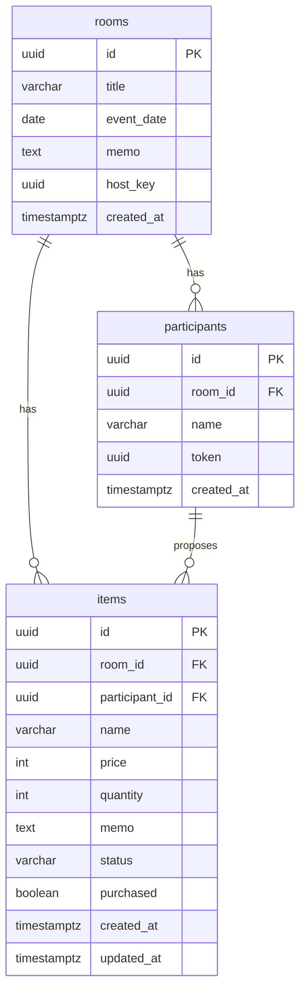

# オーダールーム 設計書（テーブル設計 → API設計）

対象: MVP（提案 → 採用 → 買い物リスト → 合計金額表示）
スタック: React + TypeScript / Spring Boot / PostgreSQL / REST(JSON)
デプロイ構成: フロント=Vercel / API=Render / **DB=Neon（PostgreSQL）**
準拠: BE ラベル issue #4〜#17 ＋ 未確認部分の追加設計（§5・§8で明記）

---

## 0. 設計方針・前提

| 項目 | 決定 | 理由 |
| --- | --- | --- |
| 主キー | UUID | 参加URL・ホスト管理URLにIDを載せるため、連番だと他ルームを推測できてしまう |
| ホスト権限 | `host_key`（UUID）を別発行し `X-Host-Key` ヘッダで送る | ログインを作らずに採用/却下/購入チェックを制御する（issue #13） |
| 参加者の本人性 | 参加時に発行する秘密値 `token` を `X-Participant-Token` ヘッダで送る | 一覧に出る `participantId` と分離し、他人の提案編集を防ぐ（§8 で追加設計） |
| 金額 | 円想定で `INTEGER` | 日本円は小数なし。小数対応が必要になれば `NUMERIC` に変更 |
| 集計 | 保存しない（SQLで都度計算） | issue #16。提案データが唯一の正 |
| 集計対象 | **採用（accepted）と提案中（pending）を両方返す** | 提案フェーズ・確定後のどちらの画面でも使えるようにする（§8-1） |
| DB | Neon（サーバーレスPostgreSQL） | 無料枠・SSL必須・Pooler利用。DDLはそのまま流用可 |
| リアルタイム | なし（画面表示時／更新時に再取得） | MVP非スコープ |

> セキュリティ強度は「イベント中に使いやすい」ことを優先した割り切り。強化案は §10 に記載。

---

## 1. ER図



---

## 2. テーブル設計

### 2.1 rooms（ルーム）— issue #6

| カラム | 型 | 制約 | 説明 |
| --- | --- | --- | --- |
| id | UUID | PK, default gen_random_uuid() | ルームID。参加URLに含める |
| title | VARCHAR(100) | NOT NULL | イベント名 |
| event_date | DATE | NULL可 | 開催日（issue案の `date` は予約語のため `event_date`） |
| memo | TEXT | NULL可 | メモ |
| host_key | UUID | NOT NULL, UNIQUE, default gen_random_uuid() | ホスト管理URL用の秘密キー |
| created_at | TIMESTAMPTZ | NOT NULL, default now() | 作成日時 |

### 2.2 participants（参加者）— issue #7（＋token 追加）

| カラム | 型 | 制約 | 説明 |
| --- | --- | --- | --- |
| id | UUID | PK | 参加者ID（**一覧APIに出る公開ID**） |
| room_id | UUID | NOT NULL, FK→rooms(id) ON DELETE CASCADE | 所属ルーム |
| name | VARCHAR(50) | NOT NULL | 表示名（空文字不可） |
| token | UUID | NOT NULL, UNIQUE, default gen_random_uuid() | **本人確認用の秘密値。参加時に一度だけ返し、一覧では返さない** |
| created_at | TIMESTAMPTZ | NOT NULL, default now() | 参加日時 |

> `token` は issue #7 のカラム案に無い追加分。アイテムの編集/削除で提案者本人を確認するために使う（§8-3）。この機能はMVPに含める前提。

### 2.3 items（提案アイテム）— issue #8

| カラム | 型 | 制約 | 説明 |
| --- | --- | --- | --- |
| id | UUID | PK | アイテムID |
| room_id | UUID | NOT NULL, FK→rooms(id) ON DELETE CASCADE | 所属ルーム |
| participant_id | UUID | NOT NULL, FK→participants(id) ON DELETE CASCADE | 提案者 |
| name | VARCHAR(100) | NOT NULL | 商品名 |
| price | INTEGER | NOT NULL default 0, CHECK(price>=0) | 単価（円） |
| quantity | INTEGER | NOT NULL default 1, CHECK(quantity>=1) | 数量 |
| memo | TEXT | NULL可 | メモ |
| status | VARCHAR(20) | NOT NULL default 'proposed', CHECK(IN) | proposed / accepted / rejected |
| purchased | BOOLEAN | NOT NULL default false | 購入済みチェック |
| created_at | TIMESTAMPTZ | NOT NULL, default now() | 作成日時 |
| updated_at | TIMESTAMPTZ | NOT NULL, default now() | 更新日時 |

#### status の値

| 値 | 意味 |
| --- | --- |
| proposed | 提案中（初期値） |
| accepted | 採用（買い物リストに載る） |
| rejected | 却下 |

> `purchased` は `status = 'accepted'` のときだけ意味を持つ。

### 2.4 DDL（PostgreSQL / Neon）

```sql
-- gen_random_uuid() は PostgreSQL 13+ 標準。Neonは対応済み

CREATE TABLE rooms (
    id          UUID PRIMARY KEY DEFAULT gen_random_uuid(),
    title       VARCHAR(100) NOT NULL,
    event_date  DATE,
    memo        TEXT,
    host_key    UUID NOT NULL DEFAULT gen_random_uuid(),
    created_at  TIMESTAMPTZ NOT NULL DEFAULT now()
);
CREATE UNIQUE INDEX idx_rooms_host_key ON rooms (host_key);

CREATE TABLE participants (
    id          UUID PRIMARY KEY DEFAULT gen_random_uuid(),
    room_id     UUID NOT NULL REFERENCES rooms (id) ON DELETE CASCADE,
    name        VARCHAR(50) NOT NULL,
    token       UUID NOT NULL DEFAULT gen_random_uuid(),
    created_at  TIMESTAMPTZ NOT NULL DEFAULT now()
);
CREATE INDEX        idx_participants_room_id ON participants (room_id);
CREATE UNIQUE INDEX idx_participants_token   ON participants (token);

CREATE TABLE items (
    id             UUID PRIMARY KEY DEFAULT gen_random_uuid(),
    room_id        UUID NOT NULL REFERENCES rooms (id) ON DELETE CASCADE,
    participant_id UUID NOT NULL REFERENCES participants (id) ON DELETE CASCADE,
    name           VARCHAR(100) NOT NULL,
    price          INTEGER NOT NULL DEFAULT 0 CHECK (price >= 0),
    quantity       INTEGER NOT NULL DEFAULT 1 CHECK (quantity >= 1),
    memo           TEXT,
    status         VARCHAR(20) NOT NULL DEFAULT 'proposed'
                     CHECK (status IN ('proposed', 'accepted', 'rejected')),
    purchased      BOOLEAN NOT NULL DEFAULT FALSE,
    created_at     TIMESTAMPTZ NOT NULL DEFAULT now(),
    updated_at     TIMESTAMPTZ NOT NULL DEFAULT now()
);
CREATE INDEX idx_items_room_id        ON items (room_id);
CREATE INDEX idx_items_room_status    ON items (room_id, status);
CREATE INDEX idx_items_participant_id ON items (participant_id);

-- updated_at 自動更新（アプリ側 @PreUpdate で行うなら不要）
CREATE OR REPLACE FUNCTION set_updated_at() RETURNS trigger AS $$
BEGIN
    NEW.updated_at = now();
    RETURN NEW;
END;
$$ LANGUAGE plpgsql;

CREATE TRIGGER trg_items_updated_at
    BEFORE UPDATE ON items
    FOR EACH ROW EXECUTE FUNCTION set_updated_at();
```

### 2.5 Neon 接続設定（issue #5）

Neonはサーバーレスのため、**SSL必須**＋**Pooler付きエンドポイント**の利用が基本。接続情報は環境変数で渡し、リポジトリにコミットしない。

```yaml
spring:
  datasource:
    # Neonダッシュボードの "Pooled connection" のホスト名（-pooler付き）を使う
    url: ${DATABASE_URL}   # 例: jdbc:postgresql://<ep>-pooler.<region>.neon.tech/<db>?sslmode=require
    username: ${DB_USER}
    password: ${DB_PASSWORD}
    hikari:
      maximum-pool-size: 5     # 無料枠の接続上限とぶつからないよう小さめに
  jpa:
    hibernate:
      ddl-auto: validate       # 本番はvalidate。スキーマはFlyway/Liquibaseで管理
```

- 開発用と本番用でNeonの**ブランチ**を分けると、同じマイグレーションを両方に適用しやすい。
- マイグレーションは Flyway 推奨（§2.4 のDDLを `V1__init.sql` 等で管理）。

---

## 3. 集計（保存せずSQLで計算）— issue #16 ＋ §8-1

`items` から算出。**採用（accepted）と提案中（proposed）の両方**を返す。却下（rejected）は金額集計から除外。

```sql
-- 全体の合計金額（採用 / 提案中）
SELECT
  COALESCE(SUM(CASE WHEN status='accepted' THEN price*quantity END),0) AS accepted_total_price,
  COALESCE(SUM(CASE WHEN status='proposed' THEN price*quantity END),0) AS pending_total_price
FROM items WHERE room_id = :roomId;

-- ステータス別の件数
SELECT status, COUNT(*) FROM items WHERE room_id = :roomId GROUP BY status;

-- 個人別（提案数 / 採用合計 / 提案中合計）
SELECT p.id, p.name,
       COUNT(i.id)                                                          AS proposal_count,
       COALESCE(SUM(CASE WHEN i.status='accepted' THEN i.price*i.quantity END),0) AS accepted_total_price,
       COALESCE(SUM(CASE WHEN i.status='proposed' THEN i.price*i.quantity END),0) AS pending_total_price
FROM participants p
LEFT JOIN items i ON i.participant_id = p.id
WHERE p.room_id = :roomId
GROUP BY p.id, p.name
ORDER BY p.created_at;

-- 商品名ごとの合計数量・金額（採用のみ＝買い物リストの数量）
SELECT name, SUM(quantity) AS total_quantity, SUM(price*quantity) AS total_price
FROM items WHERE room_id = :roomId AND status='accepted'
GROUP BY name ORDER BY total_quantity DESC;
```

---

## 4. API共通仕様

| 項目 | 内容 |
| --- | --- |
| ベースパス | `/api` |
| 形式 | JSON（UTF-8） |
| ホスト認証（issue #13） | ヘッダ `X-Host-Key: <host_key>`。不一致/欠如は 403 |
| 参加者認証（§8-3） | ヘッダ `X-Participant-Token: <token>`（自分の提案の編集/削除時）。不一致は 403 |
| 日時 | ISO 8601 |

### ステータスコード

| コード | 用途 |
| --- | --- |
| 200 / 201 / 204 | 取得・更新 / 作成 / 削除成功 |
| 400 | バリデーションエラー / 不正なstatus |
| 403 | host_key・token 不正、他人の提案を操作 |
| 404 | ルーム・アイテム不存在 |

### バリデーション（issue #17）

| 対象 | ルール |
| --- | --- |
| 参加者名 | 必須・空文字不可・最大50文字 |
| 商品名 | 必須・空文字不可・最大100文字 |
| 価格 | 0以上の整数 |
| 数量 | 1以上の整数 |
| roomId | 存在しなければ 404 |
| host_key / token | 不一致は 403 |

### エラーレスポンス形式

```json
{ "error": "FORBIDDEN", "message": "権限がありません", "fields": { "price": "0以上で入力してください" } }
```

---

## 5. エンドポイント一覧

### コアAPI（BE issueに対応）

| # | Method | パス | 権限 | Issue | 概要 |
| --- | --- | --- | --- | --- | --- |
| H | GET | `/api/health` | 誰でも | #4 | 死活監視 |
| 1 | POST | `/api/rooms` | 誰でも | #9 | ルーム作成（host_key 発行） |
| 2 | POST | `/api/rooms/{roomId}/participants` | 参加者 | #10 | 名前で参加（token 発行） |
| 3 | POST | `/api/rooms/{roomId}/items` | 参加者 | #11 | 欲しいものを提案 |
| 4 | GET | `/api/rooms/{roomId}/items` | 参加者 | #12 | 提案一覧（`?status=`絞込。買い物リストF6も） |
| 5 | PATCH | `/api/rooms/{roomId}/items/{itemId}/status` | ホスト | #14 | 採用 / 却下 |
| 6 | PATCH | `/api/rooms/{roomId}/items/{itemId}/purchased` | ホスト | #15 | 購入済みチェック |
| 7 | GET | `/api/rooms/{roomId}/summary` | 参加者 | #16 | 集計 |

### 追加設計（未確認部分。要issue化）

| # | Method | パス | 権限 | 概要 | 対応 |
| --- | --- | --- | --- | --- | --- |
| 8 | GET | `/api/rooms/{roomId}` | 参加者 | ルーム情報取得 | §8-2。**新規issue推奨** |
| 9 | PATCH | `/api/rooms/{roomId}/items/{itemId}` | 提案者/ホスト | アイテムを編集 | §8-3。**新規issue推奨** |
| 10 | DELETE | `/api/rooms/{roomId}/items/{itemId}` | 提案者/ホスト | アイテムを削除 | §8-3。**新規issue推奨** |
| A2 | GET | `/api/rooms/{roomId}/participants` | 参加者 | 参加者一覧（任意） | F9は #12 で代替可 |

---

## 6. エンドポイント詳細

### H. GET `/api/health`（issue #4）
Response `200`：`{ "status": "ok" }`（認証不要・liveness）

### 1. POST `/api/rooms`（issue #9）
Request：`{ "title": "花子の誕生日会", "eventDate": "2026-07-20", "memo": "会費3000円まで" }`
Response `201`（**host_key はここだけ返す**）
```json
{
  "id": "b7e2...", "title": "花子の誕生日会", "eventDate": "2026-07-20", "memo": "会費3000円まで",
  "hostKey": "9f13...",
  "participantUrl": "https://app.example.com/rooms/b7e2...",
  "hostUrl": "https://app.example.com/rooms/b7e2.../host?key=9f13...",
  "createdAt": "..."
}
```

### 2. POST `/api/rooms/{roomId}/participants`（issue #10）
Request：`{ "name": "太郎" }`（name 必須・空不可）
Response `201`（**token はここだけ返す**。クライアントが保持し、編集/削除時に `X-Participant-Token` で送る）
```json
{ "id": "1a2b...", "roomId": "b7e2...", "name": "太郎", "token": "77aa...", "createdAt": "..." }
```

### 3. POST `/api/rooms/{roomId}/items`（issue #11）
Request：`{ "participantId": "1a2b...", "name": "コーラ", "price": 200, "quantity": 4, "memo": "1.5Lで" }`
Response `201`：作成された item（`status` は `proposed`、`purchased` は false）

### 4. GET `/api/rooms/{roomId}/items`（issue #12）
クエリ：`?status=proposed|accepted|rejected`（省略時全件）、`?participantId=...`。買い物リストは `?status=accepted`。
Response `200`：items 配列（`participantName` 付き。**token は含めない**）

### 5. PATCH `/api/rooms/{roomId}/items/{itemId}/status`（issue #14）
ヘッダ `X-Host-Key`。Request：`{ "status": "accepted" }`（不正値は 400）。Response `200`：更新後 item

### 6. PATCH `/api/rooms/{roomId}/items/{itemId}/purchased`（issue #15）
ヘッダ `X-Host-Key`。Request：`{ "purchased": true }`。
`status != 'accepted'` のアイテムへの購入チェックは 400 を推奨。Response `200`：更新後 item

### 7. GET `/api/rooms/{roomId}/summary`（issue #16 ＋ §8-1）
Response `200`
```json
{
  "roomId": "b7e2...",
  "acceptedTotalPrice": 3200,
  "pendingTotalPrice": 1500,
  "acceptedItemCount": 5,
  "byStatus": { "proposed": 4, "accepted": 5, "rejected": 1 },
  "perParticipant": [
    { "participantId": "1a2b...", "name": "太郎", "proposalCount": 3,
      "acceptedTotalPrice": 1200, "pendingTotalPrice": 400 }
  ],
  "itemQuantities": [ { "name": "コーラ", "totalQuantity": 4, "totalPrice": 800 } ]
}
```
- `acceptedTotalPrice`＝買い物リストの合計（予算基準）、`pendingTotalPrice`＝提案中の合計。フロントは画面フェーズで使い分ける。
- `itemQuantities` は採用のみ（買い物リストの数量）。

### 8. GET `/api/rooms/{roomId}`（追加設計・§8-2）
参加者がURLから入った直後にイベント名・日付を表示するために使う（F2）。
Response `200`（**host_key は含めない**）
```json
{ "id": "b7e2...", "title": "花子の誕生日会", "eventDate": "2026-07-20", "memo": "会費3000円まで", "createdAt": "..." }
```
存在しない roomId は 404。

### 9. PATCH `/api/rooms/{roomId}/items/{itemId}`（追加設計・§8-3）
そのアイテムを編集する。**提案者本人とホストが操作できる**。
- 認証：`X-Participant-Token`（提案者本人）または `X-Host-Key`（ホスト）。どちらでもなければ 403
- status に関わらず編集可（採用済みを編集すると買い物リストの合計が変わる点に注意）
- 変更可能：`name` / `price` / `quantity` / `memo`（`status` / `purchased` はここでは変更不可）

Request（変更する項目のみ）：`{ "name": "コーラ", "price": 180, "quantity": 6 }`
Response `200`：更新後 item
Errors：403（本人でもホストでもない）/ 404 / 400（バリデーション）

### 10. DELETE `/api/rooms/{roomId}/items/{itemId}`（追加設計・§8-3）
そのアイテムを削除する。認証は #9 と同じ（提案者本人またはホスト）。Response `204`

### A2. GET `/api/rooms/{roomId}/participants`（任意）
Response `200`：`[{ "id": "...", "name": "太郎", "createdAt": "..." }]`（**token は含めない**）

---

## 7. Issue ↔ 設計 対応表

| Issue | 内容 | 対応 |
| --- | --- | --- |
| #4 | Spring Boot初期構成 / health | エンドポイント H |
| #5 | PostgreSQL接続設定 | §2.5（Neon接続設定） |
| #6 | rooms テーブル | §2.1 |
| #7 | participants テーブル | §2.2（＋token） |
| #8 | items テーブル | §2.3 |
| #9 | ルーム作成API | エンドポイント 1 |
| #10 | 参加者登録API | エンドポイント 2 |
| #11 | アイテム追加API | エンドポイント 3 |
| #12 | アイテム一覧API | エンドポイント 4（F6含む） |
| #13 | host_keyホスト確認 | §4 共通仕様 |
| #14 | 採用・却下API | エンドポイント 5 |
| #15 | 購入チェックAPI | エンドポイント 6 |
| #16 | 集計API | エンドポイント 7 / §3 |
| #17 | バリデーション・エラー処理 | §4 |
| （新規推奨） | ルーム情報取得API | エンドポイント 8 |
| （新規推奨） | participants に token 追加＋本人確認 | §2.2 / §4 / §8-3 |
| （新規推奨） | 提案の編集・削除API | エンドポイント 9・10 |

---

## 8. 未確認部分の追加設計（本改訂で確定）

### 8-1. 集計対象
「全体合計・個人別合計」を **採用（accepted）と提案中（pending）の両方** 返す方式に確定。却下は金額から除外。フロントが画面フェーズで使い分ける（提案中は pending、確定後は accepted）。→ §3・エンドポイント7。

### 8-2. ルーム情報取得API（GET /api/rooms/{roomId}）
参加導線（F2）に必須のため、補助扱いをやめてコアに格上げ。host_key は返さない。→ エンドポイント8。**BE issueの新規起票を推奨**。

### 8-3. アイテムの編集/削除（提案者＋ホスト）
みんなで作る欲しい物リストの各アイテムを、その提案者本人とホストが編集・削除できる。
- 本人確認は、一覧に出る `participantId` ではなく秘密値 `token`（§2.2）で行う。これにより一覧を見た他人が勝手に編集する事故を防ぐ。
- 操作できるのは提案者本人（`X-Participant-Token`）またはホスト（`X-Host-Key`）のみ。status によるロックはしない。
- → エンドポイント9・10。`participants.token` 追加とあわせて **BE issueの新規起票を推奨**。

### 8-4. DBデプロイ先
**Neon（サーバーレスPostgreSQL）に確定**。SSL必須・Pooler利用・接続情報は環境変数。→ §2.5。

### 追加を推奨するBE issue（起票案）
- `[BE] ルーム情報取得APIを作る`（GET /api/rooms/{roomId}）
- `[BE] participantsにtokenを追加し本人確認の仕組みを作る`
- `[BE] 自分の提案の編集・削除APIを作る`（PATCH / DELETE items/{itemId}）

---

## 9. 実装優先度の目安

1. #4・#5（起動・Neon接続）→ #6〜#8（テーブル/Entity）
2. #9・#10・#11・#12（ルーム/参加/提案/一覧の基本CRUD）＋ エンドポイント8（ルーム取得）
3. #13・#14・#15（ホスト操作）
4. #16（集計）・#17（バリデーション）
5. エンドポイント9・10（編集/削除）＝ 提案者＋ホストが操作。MVPに含める

---

## 10. MVP後の改善候補

- **item作成にもtoken必須化**：提案者のなりすまし（他人名義で提案）を防ぐ。MVPは participantId のみでも可。
- **ホストキーの露出**：`hostUrl` にキーを含むため共有時の取り扱いに注意。将来はワンタイム認証やログイン導入。
- **status を PostgreSQL ENUM 型に**：値が固まったら CHECK から移行。
- **楽観ロック**：同時編集対策に `items.version`＋`@Version`。
- **論理削除**：履歴・再利用を見据えるなら `deleted_at`。